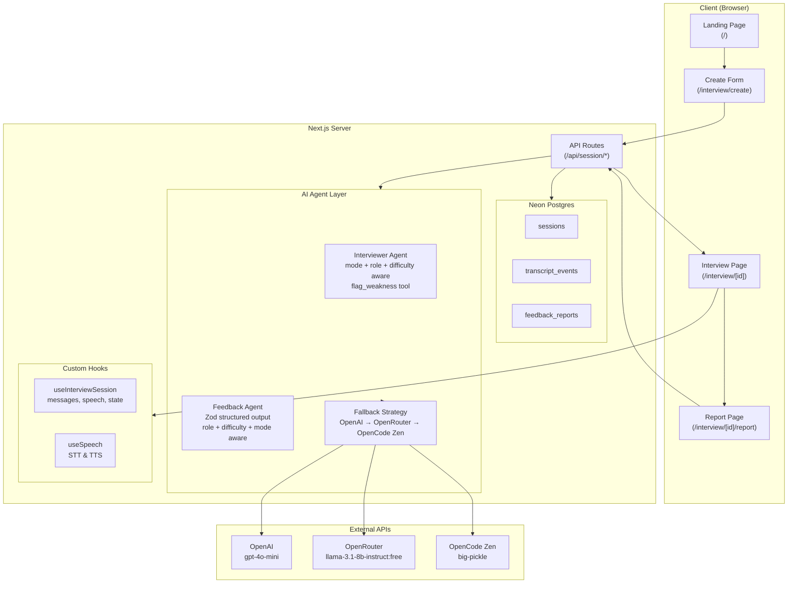
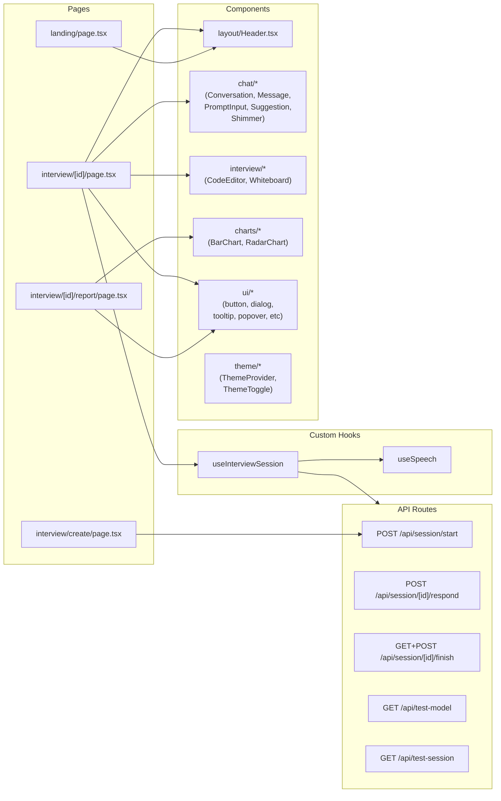
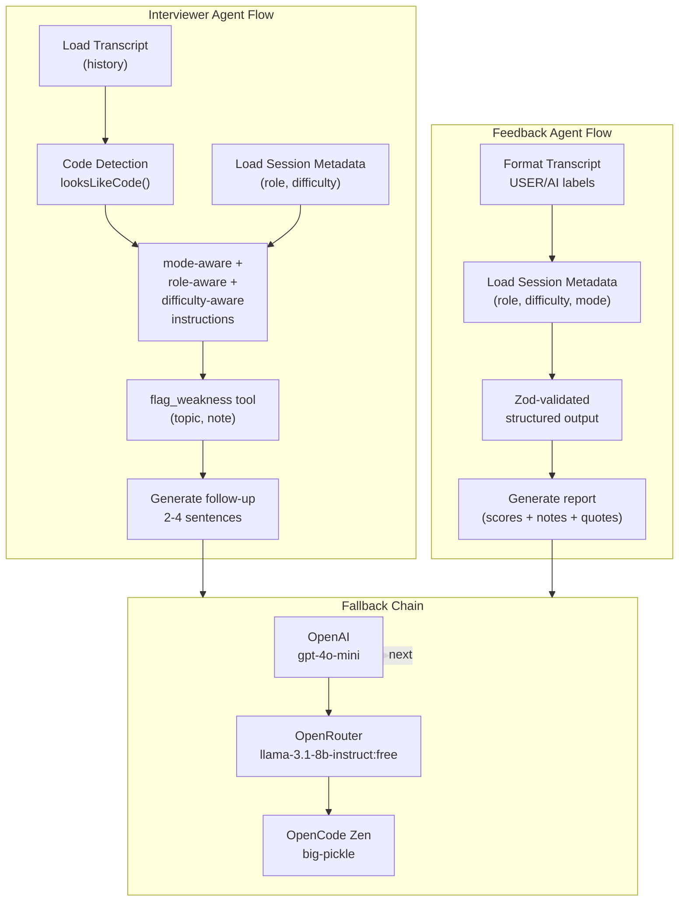
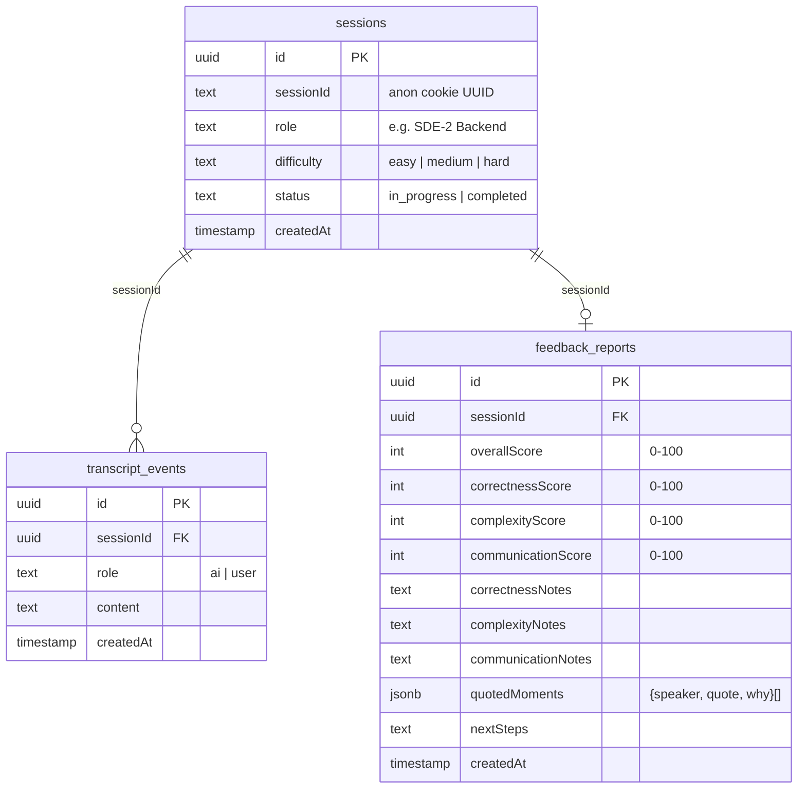
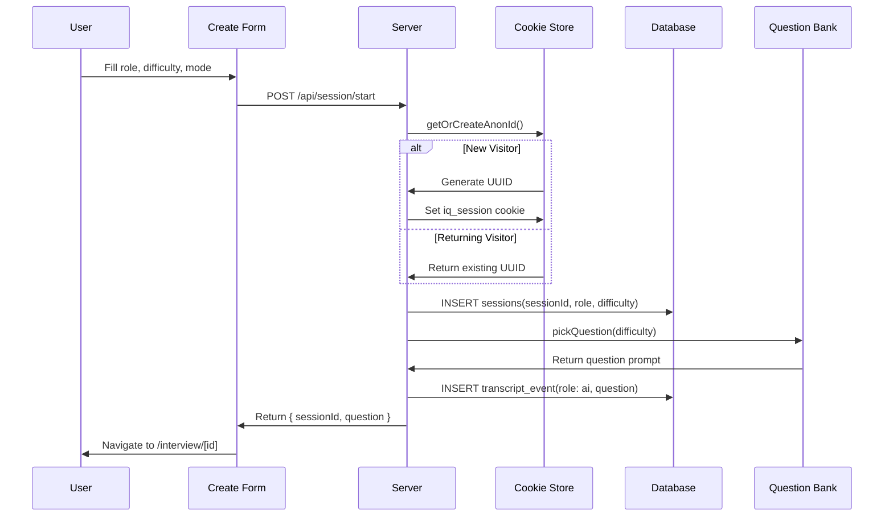
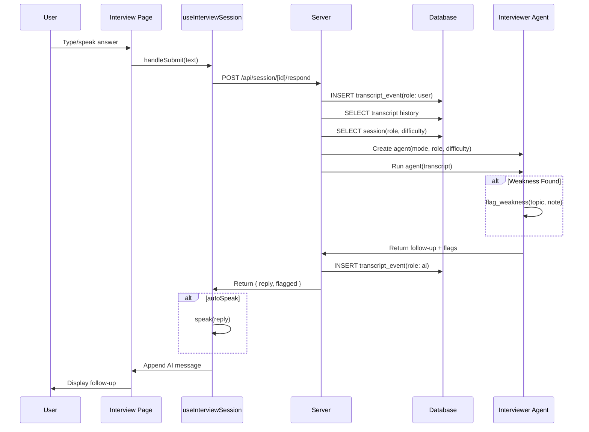
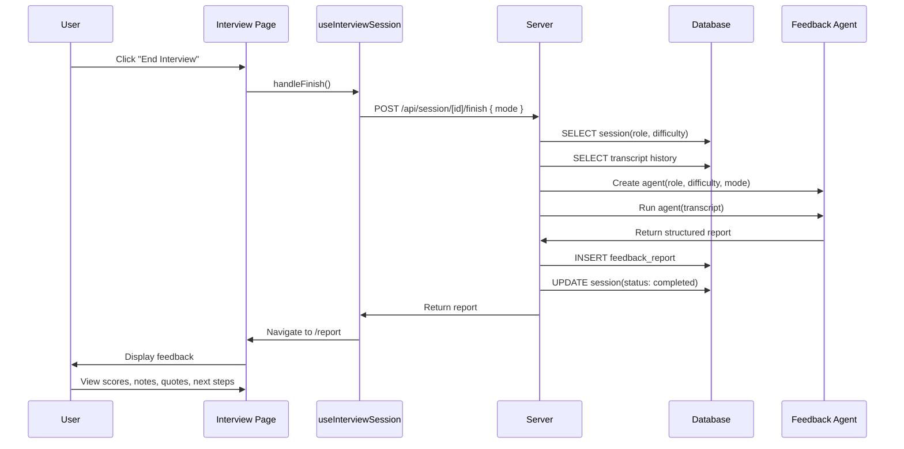
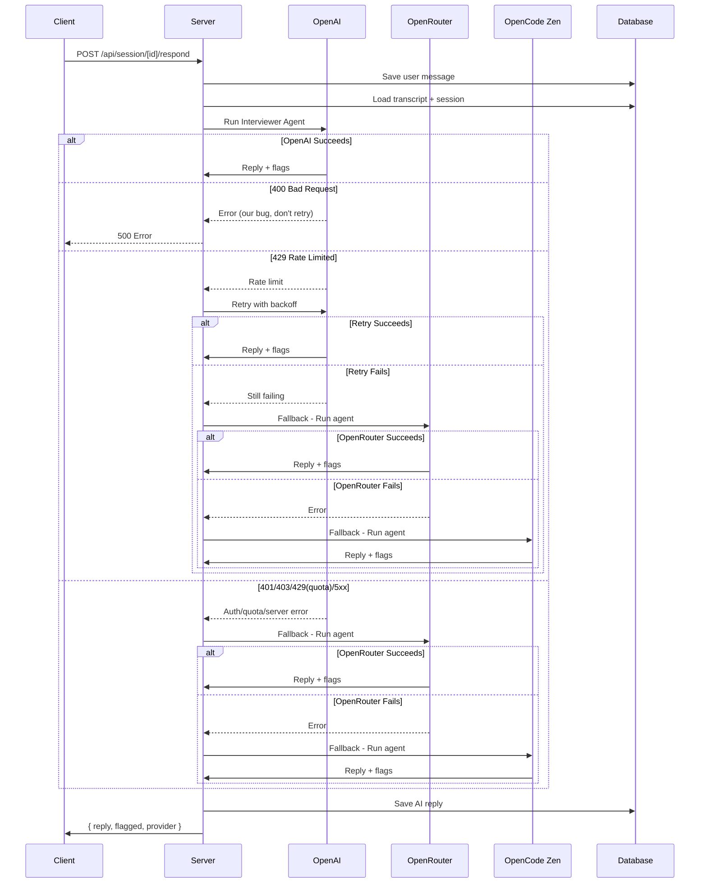

# InterviewIQ

**Free, no-login AI mock interview platform** — practice coding (DSA), system design, and behavioral interviews with a real AI interviewer that asks sharp follow-ups based on your actual answers.

Built for the **NamasteDev Codex Hackathon** with Next.js 16, React 19, OpenAI Agents SDK, Drizzle ORM, and Neon Postgres.

## Quick Start

```bash
npm install
# Copy .env.local.example → .env.local, fill in your keys
npm run db:push
npm run dev
```

## Tech Stack

| Layer | Choice |
|-------|--------|
| Framework | Next.js 16 (App Router) + React 19 |
| Language | TypeScript (strict) |
| Styling | Tailwind CSS v4 + shadcn/ui (base-nova) |
| AI Agents | OpenAI Agents SDK (`@openai/agents`) |
| Database | Drizzle ORM + Neon Postgres (serverless HTTP) |
| Auth | Anonymous UUID cookie (no login) |
| Validation | Zod |
| Charts | Chart.js + react-chartjs-2 |
| Streaming | streamdown |
| Motion | motion (Framer Motion) |

---

## High-Level Design



---

## Low-Level Design

### Component Architecture



### Agent Architecture



### Database Schema



---

## Data Flow

### Start Interview



### Answer → Follow-up Loop



### Finish → Report



### Fallback Chain



---

## Project Structure

```
interviewiq/
├── app/                    # Next.js App Router
│   ├── page.tsx            # Landing page
│   ├── layout.tsx          # Root layout with Header + font
│   ├── interview/
│   │   ├── create/         # Interview config form
│   │   └── [id]/           # Live interview + report
│   └── api/session/        # Start, respond, finish endpoints
├── components/
│   ├── layout/             # Header
│   ├── chat/               # Conversation, Message, PromptInput, etc.
│   ├── interview/          # CodeEditor, Whiteboard
│   ├── charts/             # BarChart, RadarChart
│   ├── theme/              # ThemeProvider, ThemeToggle
│   └── ui/                 # shadcn/ui primitives (25+)
├── hooks/                  # useInterviewSession, useSpeech
├── lib/                    # Core logic (agents, db, questions, etc.)
└── knowledge/              # OKF documentation
```

## API Endpoints

| Method | Path | Purpose |
|--------|------|---------|
| POST | `/api/session/start` | Create interview, pick question |
| POST | `/api/session/[id]/respond` | Submit answer, get follow-up |
| GET | `/api/session/[id]/finish` | Fetch existing report |
| POST | `/api/session/[id]/finish` | End interview, generate report |
| GET | `/api/test-model` | Verify AI fallback chain |
| GET | `/api/test-session` | Verify DB connectivity |

## Key Design Decisions

| Decision | Rationale |
|----------|-----------|
| **OpenAI Agents SDK** | Real tool calling (flag_weakness) + structured outputs (Zod) |
| **Three-tier fallback** | Free interviews survive OpenAI/OpenRouter quota limits |
| **Serverless DB (Neon HTTP)** | No connection pooling, stateless routes |
| **Anonymous sessions** | Zero friction — no login before first interview |
| **UI/Logic separation** | `hooks/useInterviewSession` keeps page.tsx pure JSX |
| **Multi-mode interviews** | Single codebase serves coding, system-design, behavioral |
| **CSV/JSON import** | Users practice on their own question banks |

## Environment Variables

```
OPENAI_API_KEY=sk-...
OPENROUTER_API_KEY=sk-or-...
OPENCODEZEN_API_KEY=sk-...
OPENAI_MODEL=gpt-4o-mini
OPENROUTER_MODEL=meta-llama/llama-3.1-8b-instruct:free
OPENCODEZEN_MODEL=big-pickle
DATABASE_URL=postgresql://...
APP_URL=http://localhost:3000
```

## Knowledge Base

InterviewIQ uses the **Open Knowledge Format (OKF)** for AI-readable documentation:

```
knowledge/_index.md           → start here
knowledge/system/             → architecture, sessions, interview-flow
knowledge/agents/             → interviewer-agent, feedback-agent
knowledge/questions/          → question bank (easy/medium/hard)
knowledge/guides/             → user-guide, developer-guide, api-reference
```

## License

MIT — see [LICENSE](./LICENSE).
